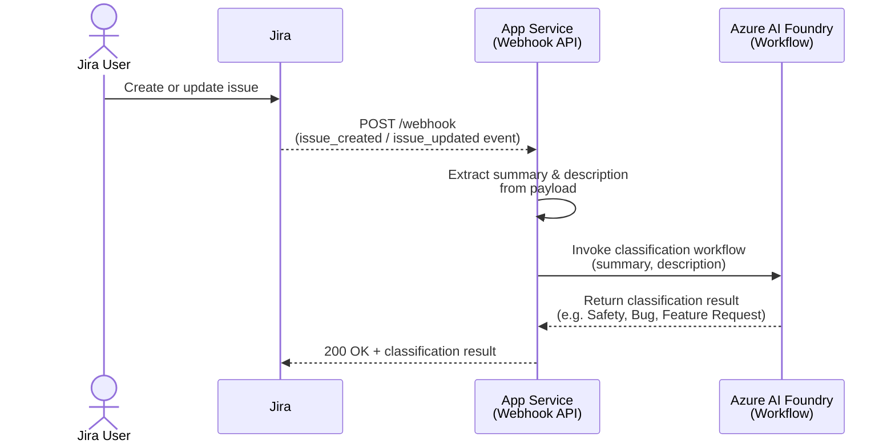

# Jira Webhook API — PoC

A lightweight **FastAPI** application that receives Jira webhook events, extracts ticket metadata, and forwards it to an **Azure AI Foundry** agent workflow for automated classification.

---

## 🗂️ Project Overview

When a Jira issue is created or updated, Jira sends a webhook payload to this API. The app extracts the ticket's `summary` and `description` from the changelog and passes them to an Azure AI agent workflow that classifies the ticket (e.g. *Safety*, *Bug*, *Feature Request*).

```
Jira → POST /webhook → FastAPI → Azure AI Foundry Workflow → Classification result
```

## 🔄 Sequence Diagram

The diagram below illustrates the end-to-end flow triggered whenever a Jira issue is created or updated.



### Step-by-step explanation

1. **Jira User creates or updates an issue** — A team member opens a new ticket or edits an existing one inside Jira.

2. **Jira fires a webhook event** — Jira detects the `issue_created` or `issue_updated` event and immediately sends an HTTP `POST` request containing the full issue payload (in JSON) to the configured webhook URL hosted on **Azure App Service**.

3. **App Service extracts ticket metadata** — The FastAPI application parses the incoming JSON payload and pulls out the two fields that matter for classification: the issue `summary` (title) and the `description` (body text).

4. **App Service invokes the Azure AI Foundry workflow** — The extracted `summary` and `description` are forwarded as inputs to a named agent workflow running inside an **Azure AI Foundry** project. The workflow is invoked using `DefaultAzureCredential` for passwordless authentication.

5. **Azure AI Foundry returns a classification** — The AI agent analyses the ticket content and responds with a classification label such as *Safety*, *Bug*, or *Feature Request*.

6. **App Service responds to Jira** — The webhook handler returns `200 OK` along with the classification result, completing the request cycle.

---

## 🚀 Getting Started

### Prerequisites

- Python 3.10+
- An [Azure AI Foundry](https://ai.azure.com) project with an agent workflow deployed
- Azure CLI logged in (`az login`) or a service principal configured for `DefaultAzureCredential`

### Installation

```bash
pip install -r requirements.txt
```

### Configuration

Copy `.env.sample` to `.env` and fill in the values:

```bash
cp .env.sample .env
```

### Run the app

```bash
uvicorn src.app:app --reload
```

The API will be available at `http://localhost:8000`.

---

## 🔌 API Endpoints

| Method | Path | Description |
|--------|------|-------------|
| `GET` | `/` | Health check — confirms the app is running |
| `POST` | `/webhook` | Receives Jira webhook event payloads (JSON) |

---

## ⚙️ Environment Variables

| Variable | Required | Description |
|----------|----------|-------------|
| `AI_PROJECT_ENDPOINT` | ✅ | Full endpoint URL of your Azure AI Foundry project |
| `WORKFLOW_NAME` | ✅ | Name of the agent workflow to invoke (e.g. `JiraTicketClassifierWorkflow`) |
| `WORKFLOW_VERSION` | ✅ | Version of the agent workflow (e.g. `1`) |

---

## ☁️ Azure Resources Required

| Resource | Purpose |
|----------|---------|
| **Azure AI Foundry project** | Hosts the agent workflow used for ticket classification |
| **Azure AI Agent** | The classification agent deployed inside the Foundry project |
| **Azure Entra ID / DefaultAzureCredential** | Used for passwordless authentication to Azure AI services |

---

## 📁 Project Structure

```
jira-webhook-api-poc/
├── src/
│   └── app.py          # FastAPI application
├── data/
│   └── sample_event.json   # Sample Jira webhook payload for testing
├── .env.sample         # Environment variable template
├── requirements.txt    # Python dependencies
└── README.md
```

